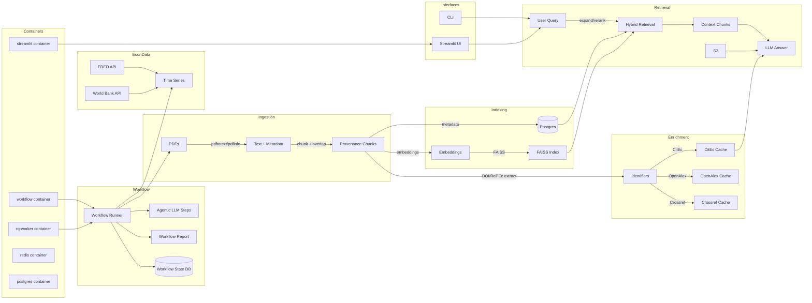

# Ragonometrics Architecture: Decisions and Rationale

This document summarizes the current Ragonometrics architecture, design tradeoffs, and operational guidance.

Overview
--------
Ragonometrics ingests PDFs, extracts per-page text for provenance, chunks with overlap, embeds chunks, indexes embeddings in FAISS, and serves retrieval + LLM summaries via CLI and a Streamlit UI. The system enriches papers with external metadata (OpenAlex, CitEc, Crossref) when available. DOI metadata can be retrieved from Crossref and cached. The system is designed to be reproducible, auditable, and scalable from local runs to a Postgres-backed deployment.

Architecture Diagram
--------------------

Key Components
--------------
- Config and prompts
  - [`config.toml`](https://github.com/badbayesian/ragonometrics/blob/main/config.toml) (optional) is the primary configuration surface with env-var overrides.
  - Centralized prompts live in [`ragonometrics/core/prompts.py`](https://github.com/badbayesian/ragonometrics/blob/main/ragonometrics/core/prompts.py).
- Package layout (logical groupings)
  - [`ragonometrics/core/`](https://github.com/badbayesian/ragonometrics/tree/main/ragonometrics/core): settings, ingestion, extraction, core prompts, logging.
  - [`ragonometrics/pipeline/`](https://github.com/badbayesian/ragonometrics/tree/main/ragonometrics/pipeline): LLM call wrapper, query cache, token usage accounting.
  - [`ragonometrics/indexing/`](https://github.com/badbayesian/ragonometrics/tree/main/ragonometrics/indexing): FAISS indexing, Postgres metadata, hybrid retrieval, migrations.
  - [`ragonometrics/integrations/`](https://github.com/badbayesian/ragonometrics/tree/main/ragonometrics/integrations): Crossref cache, OpenAlex, CitEc, Redis/RQ jobs.
  - [`ragonometrics/ui/`](https://github.com/badbayesian/ragonometrics/tree/main/ragonometrics/ui): Streamlit app.
  - [`ragonometrics/eval/`](https://github.com/badbayesian/ragonometrics/tree/main/ragonometrics/eval): eval + benchmark tooling.
- PDF extraction and preprocessing
  - `pdftotext` + `pdfinfo` (Poppler) with OCR fallback.
  - Per-page extraction supports provenance (page + word offsets).
  - Optional section-aware chunking (title/abstract/introduction/methods/results) via `SECTION_AWARE_CHUNKING`.
- Embeddings and retrieval
  - OpenAI embeddings via `embed_texts`.
  - Hybrid BM25 + FAISS retrieval when `DATABASE_URL` is configured.
  - Optional query expansion (`QUERY_EXPANSION`) and LLM reranking (`RERANKER_MODEL`, `RERANK_TOP_N`).
- Indexing
  - FAISS `IndexFlatIP` with normalized vectors.
  - Index versions are tracked with `index_id` and a sidecar JSON next to FAISS artifacts.
  - Postgres metadata stores vectors, index shards, and index version rows.
  - Idempotent indexing based on a deterministic key (same corpus + params).
- UI and CLI
  - Streamlit UI ([`ragonometrics/ui/streamlit_app.py`](https://github.com/badbayesian/ragonometrics/blob/main/ragonometrics/ui/streamlit_app.py)) provides Chat, DOI Network, and Usage tabs.
  - External metadata (OpenAlex with CitEc fallback) is shown in a UI expander and injected into prompts.
  - Console entrypoints: `ragonometrics index | query | ui | benchmark`.
- Agentic workflow
- [`ragonometrics/pipeline/workflow.py`](https://github.com/badbayesian/ragonometrics/blob/main/ragonometrics/pipeline/workflow.py) orchestrates prep -> ingest -> enrich -> index -> evaluate -> report.
  - State persisted in SQLite via [`ragonometrics/pipeline/state.py`](https://github.com/badbayesian/ragonometrics/blob/main/ragonometrics/pipeline/state.py).
  - Optional async execution with Redis + RQ ([`ragonometrics/integrations/rq_queue.py`](https://github.com/badbayesian/ragonometrics/blob/main/ragonometrics/integrations/rq_queue.py)).
  - Optional agentic step plans sub-questions, retrieves context, and synthesizes an answer.
- Caching
  - Crossref responses cached in Postgres when a cache DB is provided.
  - OpenAlex metadata cached in SQLite ([`sqlite/ragonometrics_openalex.sqlite`](https://github.com/badbayesian/ragonometrics/blob/main/sqlite/ragonometrics_openalex.sqlite)).
  - CitEc metadata cached in SQLite ([`sqlite/ragonometrics_citec.sqlite`](https://github.com/badbayesian/ragonometrics/blob/main/sqlite/ragonometrics_citec.sqlite)).
  - Query/answer cache stored in local SQLite ([`sqlite/ragonometrics_query_cache.sqlite`](https://github.com/badbayesian/ragonometrics/blob/main/sqlite/ragonometrics_query_cache.sqlite)).
  - Token usage captured in SQLite ([`sqlite/ragonometrics_token_usage.sqlite`](https://github.com/badbayesian/ragonometrics/blob/main/sqlite/ragonometrics_token_usage.sqlite)).

Data and Metadata Stores
------------------------
- Postgres (`DATABASE_URL`):
  - `vectors`, `index_shards`, `index_versions`, `pipeline_runs`, and failure logs.
- Local artifacts:
  - FAISS indexes in [`vectors.index`](https://github.com/badbayesian/ragonometrics/blob/main/vectors.index) and versioned shards in [`indexes/`](https://github.com/badbayesian/ragonometrics/tree/main/indexes).
  - Index version sidecar JSON next to each shard.
  - Query cache in [`sqlite/ragonometrics_query_cache.sqlite`](https://github.com/badbayesian/ragonometrics/blob/main/sqlite/ragonometrics_query_cache.sqlite).
  - OpenAlex cache in [`sqlite/ragonometrics_openalex.sqlite`](https://github.com/badbayesian/ragonometrics/blob/main/sqlite/ragonometrics_openalex.sqlite).
  - CitEc cache in [`sqlite/ragonometrics_citec.sqlite`](https://github.com/badbayesian/ragonometrics/blob/main/sqlite/ragonometrics_citec.sqlite).
  - Usage tracking in [`sqlite/ragonometrics_token_usage.sqlite`](https://github.com/badbayesian/ragonometrics/blob/main/sqlite/ragonometrics_token_usage.sqlite).
  - Workflow state in [`sqlite/ragonometrics_workflow_state.sqlite`](https://github.com/badbayesian/ragonometrics/blob/main/sqlite/ragonometrics_workflow_state.sqlite).

Reproducibility
---------------
- A config hash is computed from effective settings (config + env overrides).
- [`config.toml`](https://github.com/badbayesian/ragonometrics/blob/main/config.toml) is the primary config surface; env vars override for deploys.
- A prep manifest records corpus fingerprints and file-level metadata before ingestion.
- Each indexing run writes a manifest JSON next to the index shard containing:
  - git SHA, dependency fingerprints, config hash + effective config snapshot.
  - corpus fingerprint, embedding dim + hashes, chunking scheme, timestamps, and artifact paths.
  - deterministic paper list with stable `doc_id`s and per-chunk `chunk_id` + `chunk_hash` entries for diffable runs.

Tradeoffs
---------
- **Local-only (FAISS + SQLite) vs Postgres-backed**: Local runs are fast and low-friction but limit hybrid retrieval, shared indexing, and team access. Postgres adds infra overhead but enables multi-user metadata, hybrid retrieval, and durable indexing.
- **Determinism vs throughput**: Stable ordering, chunk hashes, and manifest recording improve auditability but add compute and I/O overhead during ingestion and indexing.
- **Agentic depth vs cost**: Agentic workflows improve coverage and synthesis quality but increase latency and token usage; structured questions are cheaper and more predictable.
- **Citations and provenance vs speed**: Citation extraction and page-level provenance improve trustworthiness but add extra parsing and retrieval work.
- **Hybrid retrieval vs simplicity**: BM25 + reranking can improve relevance but introduces more tuning surface and failure modes compared to pure vector search.

Retrieval Quality Controls
--------------------------
- Optional query expansion and LLM reranking to improve relevance.
- Section-aware chunking enriches chunk metadata and retrieval provenance.
- Guardrails prevent retrieval when the FAISS shard and DB `index_id` disagree.

Operational Hardening
---------------------
- Idempotent indexing: same corpus + params does not double-insert.
- Structured JSON logging for key operations.
- OpenAI and Crossref calls include retries and failure recording in Postgres.
- OpenAlex and CitEc calls include retries and local caching.

Economics Data
--------------
- FRED and World Bank connectors live in [`ragonometrics/integrations/econ_data.py`](https://github.com/badbayesian/ragonometrics/blob/main/ragonometrics/integrations/econ_data.py).
- Example workflow in [`tools/econ_workflow.py`](https://github.com/badbayesian/ragonometrics/blob/main/tools/econ_workflow.py) (see [`docs/data/econ_schema.md`](https://github.com/badbayesian/ragonometrics/blob/main/docs/data/econ_schema.md)).

Evaluation
----------
- [`ragonometrics/eval/eval.py`](https://github.com/badbayesian/ragonometrics/blob/main/ragonometrics/eval/eval.py) provides retrieval metrics (recall@k, MRR) and answer proxies
  (citation coverage, hallucination proxy, self-consistency).
- Golden-set format supports curated Q/A and expected citations.

Queueing
--------
- Redis + RQ ([`ragonometrics/integrations/rq_queue.py`](https://github.com/badbayesian/ragonometrics/blob/main/ragonometrics/integrations/rq_queue.py)) for async indexing jobs.

Benchmarks
----------
- [`ragonometrics/eval/benchmark.py`](https://github.com/badbayesian/ragonometrics/blob/main/ragonometrics/eval/benchmark.py) and [`tools/benchmark.py`](https://github.com/badbayesian/ragonometrics/blob/main/tools/benchmark.py) measure indexing, chunking, and retrieval timing.

Entrypoints
-----------
- `ragonometrics index` builds FAISS indexes.
- `ragonometrics query` runs a question against a paper.
- `ragonometrics ui` launches the Streamlit UI.
- `ragonometrics benchmark` runs the benchmark suite.
- `ragonometrics workflow` runs the multi-step (optionally agentic) workflow.

Containerization
----------------
- [`Dockerfile`](https://github.com/badbayesian/ragonometrics/blob/main/Dockerfile) installs package dependencies and Poppler.
- [`compose.yml`](https://github.com/badbayesian/ragonometrics/blob/main/compose.yml) defines services for UI, workflow, Redis, RQ worker, and Postgres.
- Services run code from the image by default; add a bind mount for live code editing if desired.

