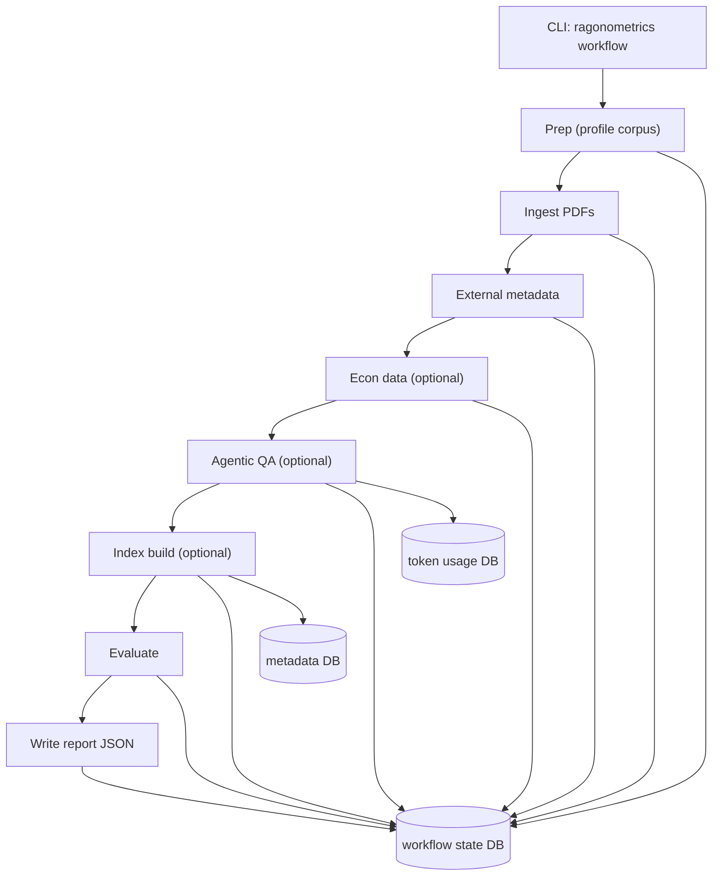

# Ragonometrics Workflow Architecture

This document describes the workflow subsystem: how it orchestrates multi-step runs, what it reads and writes, how it handles errors, and what artifacts it produces.

Overview
--------
The workflow runner coordinates ingestion, enrichment, optional econ data pulls, optional agentic QA, optional indexing, evaluation, and report emission. It is implemented in [`ragonometrics/pipeline/workflow.py`](https://github.com/badbayesian/ragonometrics/blob/main/ragonometrics/pipeline/workflow.py) and persists state transitions to SQLite ([`sqlite/ragonometrics_workflow_state.sqlite`](https://github.com/badbayesian/ragonometrics/blob/main/sqlite/ragonometrics_workflow_state.sqlite)).

Workflow Diagram
----------------

Entry Points
------------
- CLI: `ragonometrics workflow --papers <path> [--agentic ...]`
- Queue: [`ragonometrics/integrations/rq_queue.py`](https://github.com/badbayesian/ragonometrics/blob/main/ragonometrics/integrations/rq_queue.py) enqueues `workflow_entrypoint`

The `--papers` flag accepts either a **directory** or a **single PDF file**. The runner normalizes this into a list of PDF paths.

Step-by-Step Behavior
---------------------
1) Prep  
   - Profiles the corpus, computes a corpus hash, and writes a prep manifest.  
   - Optionally hashes files and validates text extraction (configurable via env).  

2) Ingest  
   - Discovers PDFs (`.pdf`) and extracts page-level text.  
   - Uses `pdftotext` + `pdfinfo`, with OCR fallback if enabled.  
   - Emits counts and creates `Paper` objects.

3) Enrich  
   - Fetches OpenAlex metadata, falling back to CitEc when OpenAlex data is missing.  
   - Only used as context for downstream analysis.

4) Econ Data (optional)  
   - Pulls FRED series if `FRED_API_KEY` or `ECON_SERIES_IDS` are set.

5) Agentic (optional)  
   - Generates sub-questions (agentic plan).  
   - Answers each sub-question with retrieval context.  
   - Builds a final synthesized answer.  
   - Optionally extracts citations for context enrichment.  
   - Generates structured report questions (A-K) and optional "previous questions" set.

6) Index (optional)  
   - Builds FAISS index + Postgres metadata if `DATABASE_URL` is reachable.  
   - Skips gracefully if DB is unreachable.

7) Evaluate  
   - Computes light-weight chunk statistics (avg/max/min).

8) Report  
   - Writes a JSON report to [`reports/workflow-report-<run_id>.json`](https://github.com/badbayesian/ragonometrics/tree/main/reports).

Artifacts and State
-------------------
- Workflow state DB: [`sqlite/ragonometrics_workflow_state.sqlite`](https://github.com/badbayesian/ragonometrics/blob/main/sqlite/ragonometrics_workflow_state.sqlite)
  - `workflow_runs` tracks run metadata and status.
  - `workflow_steps` tracks step outputs, timestamps, status.
- Prep manifest: [`reports/prep-manifest-<run_id>.json`](https://github.com/badbayesian/ragonometrics/tree/main/reports)
- Report JSON: [`reports/workflow-report-<run_id>.json`](https://github.com/badbayesian/ragonometrics/tree/main/reports)
- Usage tracking: [`sqlite/ragonometrics_token_usage.sqlite`](https://github.com/badbayesian/ragonometrics/blob/main/sqlite/ragonometrics_token_usage.sqlite)
- Optional FAISS + metadata: [`vectors.index`](https://github.com/badbayesian/ragonometrics/blob/main/vectors.index), [`indexes/`](https://github.com/badbayesian/ragonometrics/tree/main/indexes), Postgres tables.

Report Schema Highlights
------------------------
Each report includes:
- `run_id`, `started_at`, `finished_at`
- `config` snapshot (effective config + hash)
- Step outputs under `prep`, `ingest`, `enrich`, `econ_data`, `agentic`, `index`, `evaluate`

Agentic outputs include:
- `subquestions`, `sub_answers`, `final_answer`
- `report_questions` list with rich fields:
  - `answer`, `question_tokens_estimate`, `evidence_type`, `confidence`
  - `confidence_score` (0-1), `retrieval_method`
  - `citation_anchors` (page + word offsets)
  - `quote_snippet`, `table_figure`, `data_source`
  - `assumption_flag`, `assumption_notes`, `related_questions`
  - `confidence` is derived from retrieval scores (not model self-report).
  - `confidence_score` is the numeric retrieval score used to set the label.

Concurrency
-----------
- Report questions are executed concurrently (default 8 workers).
- Control with `WORKFLOW_REPORT_QUESTION_WORKERS`.

Failure Handling
----------------
- Step failures are recorded with `status: failed` and error text.
- If Postgres is unreachable, indexing is skipped with `reason: db_unreachable`.
- If hybrid retrieval fails, the agentic step falls back to local embedding retrieval.

Key Configuration Flags
-----------------------
| Name | Description | Default | Type | Notes |
| --- | --- | --- | --- | --- |
| `WORKFLOW_AGENTIC` | Enable agentic step. | `0` | bool | Use `1` to enable. |
| `WORKFLOW_QUESTION` | Main workflow question. | `Summarize the paper's research question, methods, and key findings.` | string | Uses the built-in summary question when unset. |
| `WORKFLOW_AGENTIC_MODEL` | Model override for agentic step. | `CHAT_MODEL` | string | Falls back to chat model. |
| `WORKFLOW_AGENTIC_CITATIONS` | Enable citation extraction. | `0` | bool | Use `1` to enable. |
| `WORKFLOW_REPORT_QUESTIONS` | Enable structured report questions. | `1` | bool | Use `0` to disable. |
| `WORKFLOW_REPORT_QUESTIONS_SET` | Report question set to run. | `structured` | enum | `structured|agentic|both|none`. |
| `WORKFLOW_REPORT_QUESTION_WORKERS` | Concurrency for report questions. | `8` | int | |
| `DATABASE_URL` | Postgres URL for indexing + hybrid retrieval. | empty | string (URL) | |
| `FRED_API_KEY` | FRED API key for econ step. | unset | string | Enables econ step. |
| `ECON_SERIES_IDS` | FRED series IDs. | empty | CSV string | Defaults to `GDPC1,FEDFUNDS` when econ step enabled with no list. |
| `PREP_HASH_FILES` | Hash PDF files during prep. | `1` | bool | Set `0` for faster scans. |
| `PREP_VALIDATE_TEXT` | Run text extraction during prep. | `0` | bool | Enables empty-text detection. |
| `PREP_FAIL_ON_EMPTY` | Fail workflow if corpus is empty. | `0` | bool | Treats no PDFs or no text as failure. |
| `PREP_VALIDATE_ONLY` | Exit after prep step. | `0` | bool | Writes report and skips ingest/agentic/index. |

See [Configuration](https://github.com/badbayesian/ragonometrics/blob/main/docs/configuration/configuration.md) for the full list.

Performance Tips
----------------
- Use `report-question-set agentic` for faster runs.
- Lower `TOP_K` or increase `CHUNK_WORDS` to reduce retrieval cost.
- Disable citations if not needed.

Code Locations
--------------
- Orchestration: [`ragonometrics/pipeline/workflow.py`](https://github.com/badbayesian/ragonometrics/blob/main/ragonometrics/pipeline/workflow.py)
- State persistence: [`ragonometrics/pipeline/state.py`](https://github.com/badbayesian/ragonometrics/blob/main/ragonometrics/pipeline/state.py)
- Report schema: [`ragonometrics/pipeline/workflow.py`](https://github.com/badbayesian/ragonometrics/blob/main/ragonometrics/pipeline/workflow.py) (agentic report section)
